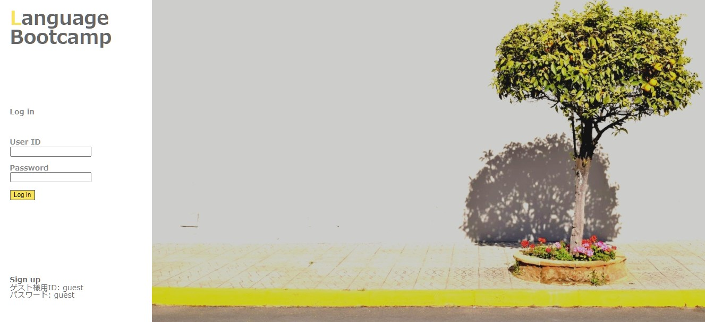
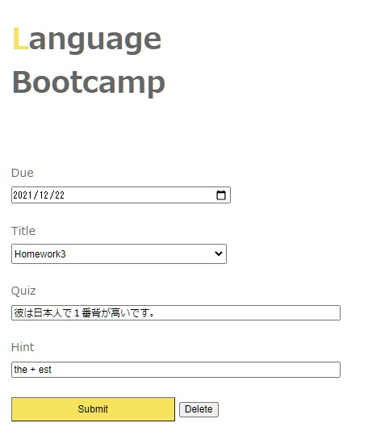
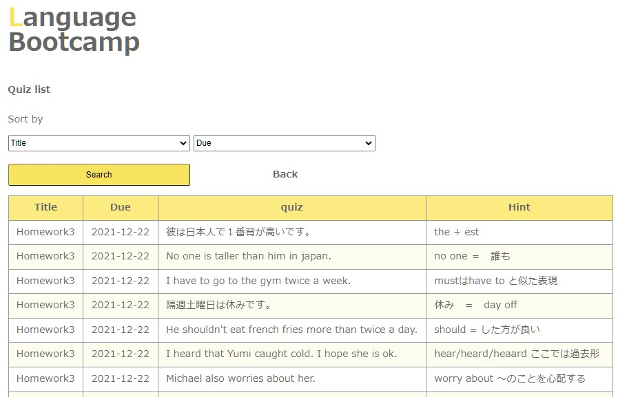
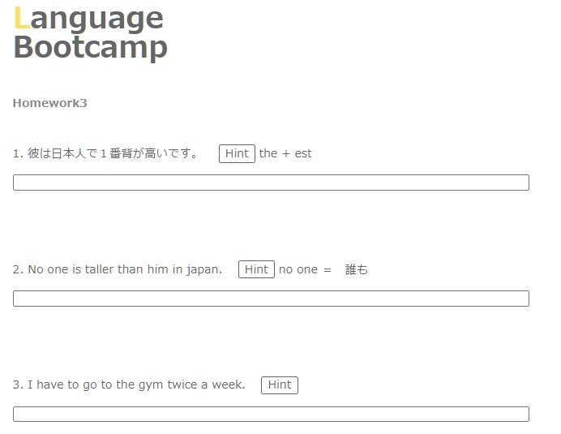

# Language Bootcamp

"Language Bootcamp" は語学学習サイトです。あらかじめ登録された問題を解いて、提出することができます。

URI: webtaro.sakura.ne.jp

ゲスト様用ID: guest

パスワード: guest

  
  

## 制作意図

スカイプ等で外国の友人と語学を教えあう機会が多いので１度自分が作った問題文を使って他の人も気軽に勉強できれば便利だな、と思い作りました。

## デモ

ログイン、ユーザー登録機能

問題の新規作成/編集/削除ページ

問題の一覧表示
タイトル、提出期限で絞り込み検索ができます。
表示されている問題文をクリックすることで編集画面に切り替わります。

解答画面
submit ボタンでデータベースへ送信されます。

## 使用した技術
HTML 5
CSS 3
JavaScript(jQuery 3.3.1)
PHP 8.0.10
MySQL 4.9.5

## 工夫したポイント
1. 全てを一覧表示してしまうと特定の問題を探し出すのに時間がかかってしまうので絞り込み機能の追加によって、必要な情報だけを閲覧できるようにしました。

2. クイズ一覧ページでクリックされた問題文のIDを
新規作成ページにPOSTで渡すことによってフォームの内容を既に記入された状態（編集できる状態）にしました。
POSTで受け取った値を使ってプリペアードステートメントでデータを取り出す方法を学びました。

  

## 課題、今後実装したいもの

 
1. 現在、英語を勉強している日本人向けの問題や、日本語を勉強しているスペイン人向けの問題等、混ざって表示されているので、
ログインした時点でそのユーザーが学習している言語の問題だけが表示されるようにしたいです。

  

2. 問題文の情報を取得するclassを作成して、コードをもう少しスッキリさせるつもりです。

  

  
